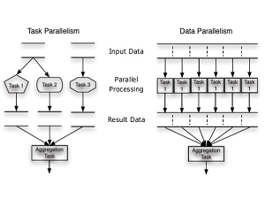
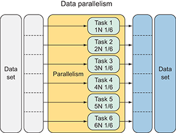

<h1 align="center">
    <b>
        <br>
        # Tugas Besar 2 IF3230 Sistem Paralel dan Terdistribusi
        <br>
    </b>
</h1>

<h2 align="center">
    <b>
        <br>
        OpenMP - Dijkstra Algorithm
        <br>
        <br>
    </b>
</h2>

## Petunjuk Penggunaan Program
* Compile: <br>
  ketikan ```make``` pada direktori tempat ```makefile``` berada
* Run: <br>
  ketikan ```run``` pada direktori tempat ```makefile``` berada

## Laporan Pengerjaan
### Deskripsi Solusi Paralel
Solusi paralel yang dilakukan adalah data parallelism karena data yang ada dibagi-bagi ke *thread* yang ada, sehingga *thread* pusat hanya bertugas untuk menerima hasil dari pemrosesan algoritma dijkstra yang dilakukan oleh *thread* lain. Hasil pemrosesan algoritma dijkstra merupakan satu baris dari matriks jarak antar node. <br>
<div align="center">
    
</div>

Cara kerja program:
1. Program menginisiasi graf dalam bentuk matriks berukuran N x N
2. Untuk setiap baris dan kolom, program mengisi nilai *random* yang didapat dari funsi ```rand()``` dengan seed ```13517020``` atau ```13517137```
3. Program mulai menjalankan algoritma dijkstra untuk mencari nilai cost minimum yang dibutuhkan dari node-x untuk mencapai node-y
   * Jika jumlah *thread* yang digunakan hanya 1, program akan menjalankan algoritma dijkstra secara serial
   * Jika jumlah *thread* yang digunakan lebih dari 1, program akan menjalankan algoritma dijkstra secara paralel
     * *thread* dengan nilai ```rank = 0``` menerima hasil pemrosesan graf menggunakan algoritma dijkstra dari *thread-thread* lain
     * *thread* dengan nilai ```rank ≠ 0``` melakukan pemrosesan graf menggunakan algoritma dijkstra untuk dikirimkan ke *thread* dengan nilai ```rank = 0```

### Analisis Solusi
* Kelebihan:
  * Setiap *thread* membaca dari satu memory yang sama
  * Jika *thread* yang digunakan hanya 1 program akan langsung menjalankan algoritma dijkstra secara serial
  * Lebih hemat *memory space* karena alokasi *memory* menyesuaikan input jumlah nodes
* Kelemahan:
  * Karena menggunakan satu server, perbedaan waktu yang dibutuhkan antara 1 *thread*, 2 *thread*, 3 *thread*, dst. tidak berbeda jauh
* Solusi yang lebih baik:
  * Dapat menggunakan beberapa server tetapi disaat yang bersamaan masih dapat mengakses *memory* yang sama

### Jumlah Thread yang Digunakan
6 *thread* karena dari hasil percobaan kami, waktu yang dibutuhkan untuk mendapatkan solusi dengan menggunakan 6 thread jauh lebih cepat dibandingkan jika menggunakan 5 thread, 4 thread, 3 thread, 2 thread dan 1 thread (serial). Hal ini disebabkan oleh jumlah data yang dibagi untuk setiap thread menurun sesuai dengan banyaknya thread yang digunakan sehingga thread dapat menyelesaikan tugasnya lebih cepat.
<div align="center">
    
</div>

### Pengukuran Kinerja Algoritma Paralel dengan Serial
| Jumlah Thread | Jumlah Node |  Waktu 1 (μs) |  Waktu 2 (μs) |  Waktu 3 (μs) |
|:-------------:|:-----------:|:-------------:|:-------------:|:-------------:|
|   1 (Serial)  |         100 |     11809.000 |     11341.000 |     11738.000 |
|   1 (Serial)  |         500 |   1330483.000 |   1336266.000 |   1346888.000 |
|   1 (Serial)  |        1000 |  11306142.000 |  11269185.000 |  11353796.000 |
|   1 (Serial)  |        3000 | 328869828.000 | 322524927.000 | 320788807.000 |
|   2 (Paralel) |         100 |      8630.000 |      8863.000 |      9170.000 |
|   2 (Paralel) |         500 |   1344506.000 |   1341028.000 |   1353119.000 |
|   2 (Paralel) |        1000 |  11188346.000 |  11266470.000 |  11314343.000 |
|   2 (Paralel) |        3000 | 326371659.000 | 322214533.000 | 324375813.000 |
|   3 (Paralel) |         100 |     11494.000 |     12541.000 |     13622.000 |
|   3 (Paralel) |         500 |   1315593.000 |   1350490.000 |   1337863.000 |
|   3 (Paralel) |        1000 |  11335433.000 |  11406718.000 |  11197439.000 |
|   3 (Paralel) |        3000 | 329445759.000 | 323444526.000 | 379086253.000 |
|   4 (Paralel) |         100 |     11883.000 |     11533.000 |     12161.000 |
|   4 (Paralel) |         500 |   1339848.000 |   1339332.000 |   1344472.000 |
|   4 (Paralel) |        1000 |  11513116.000 |  11305632.000 |  11336602.000 |
|   4 (Paralel) |        3000 | 328357001.000 | 324471460.000 | 323581156.000 |
|   5 (Paralel) |         100 |     12112.000 |     11359.000 |     11571.000 |
|   5 (Paralel) |         500 |   1335812.000 |   1341126.000 |   1363780.000 |
|   5 (Paralel) |        1000 |  11310832.000 |  11268102.000 |  11176265.000 |
|   5 (Paralel) |        3000 | 323646028.000 | 328808488.000 | 383983323.000 |
|   6 (Paralel) |         100 |     11432.000 |     11358.000 |     11560.000 |
|   6 (Paralel) |         500 |   1342867.000 |   1371984.000 |   1333992.000 |
|   6 (Paralel) |        1000 |  11332027.000 |  11301639.000 |  11337420.000 |
|   6 (Paralel) |        3000 | 321272669.000 | 324136484.000 | 323526201.000 |

### Analisis Perbandingan Kinerja Serial dan Paralel
Algoritma dijkstra yang dijalankan secara serial memakan waktu tidak jauh berbeda dibandingkan dengan algoritma dijkstra yang dijalankan secara paralel karena jumlah server yang digunakan sama antara serial dengan paralel.

## Pembagian Tugas
* 13517020 mengerjakan convert fungsi algoritma dijkstra openMPI to openMP, makefile dan laporan
* 13517137 mengerjakan convert fungsi algoritma dijkstra openMPI to openMP, makefile dan laporan